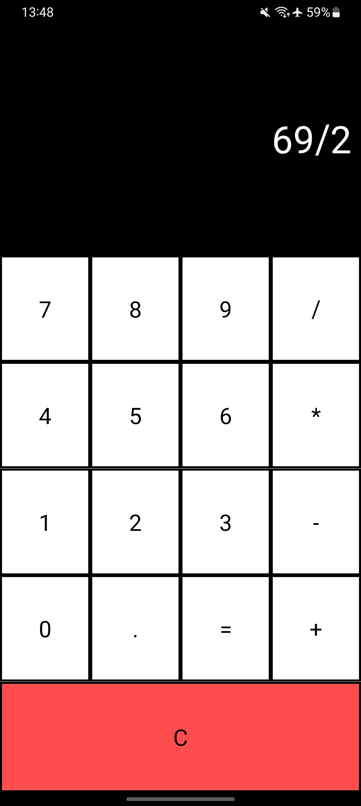
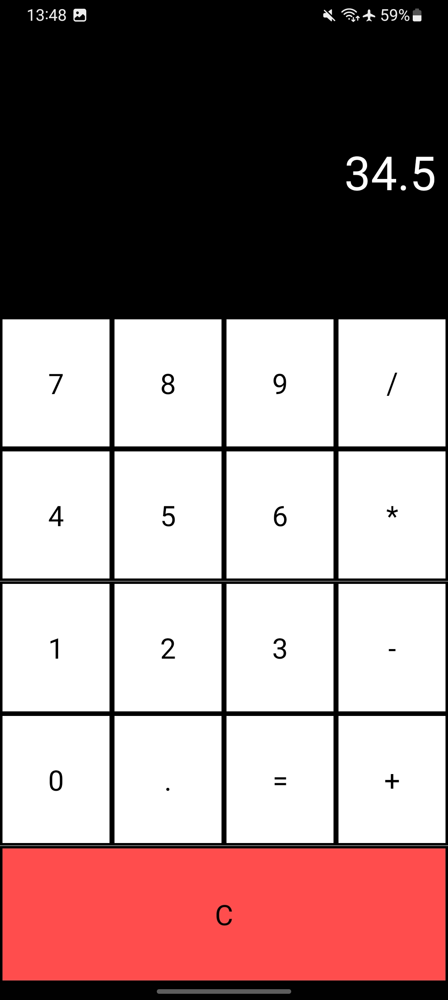
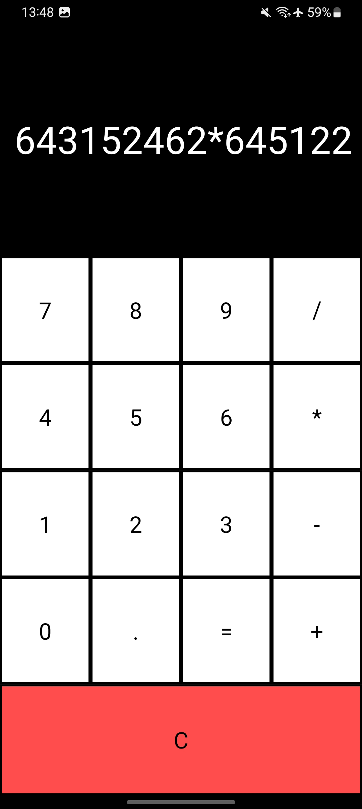

# Componentized Calculator in React Native

This is a React Native application that implements a simple and componentized calculator with basic addition, subtraction, multiplication, and division operations. The components are separated to create a more modular and readable structure.

## Components

The application consists of three main components:

### `Button.js`

This component represents the numeric and operator buttons of the calculator. It is reused to create buttons for 0 to 9, the operators (+, -, *, /), the decimal point (.), and the equals (=) button.

### `CalculatorScreen.js`

This component displays the calculator's screen, where the result is shown. It updates dynamically as the user enters numbers and performs calculations.

### `Calculator.js`

This is the main component that composes the calculator. It manages the calculator's logic, including input handling, calculations, and clearing the display.

## Features

- Numeric buttons from 0 to 9.
- Operator buttons: +, -, *, /.
- Decimal button (.) for decimal numbers.
- Equals (=) button to calculate the result.
- Clear (C) button to reset the calculator.
- Dynamic display of the result as the user enters numbers and performs calculations.

## Prints
<p align="center">
  
   
  
</p>

## Usage

1. Clone this repository to your local machine:

   ```bash
   git clone https://github.com/SauloCav/React-Native-Calculator
   ```

2. Install the dependencies using npm or yarn:

   Using npm:

   ```bash
   npm install
   ```

   Using yarn:

   ```bash
   yarn install
   ```

3. Run the application on an emulator or real device:

   Command to start the app on an Android emulator:

   ```bash
   npx react-native run-android
   ```

   Command to start the app on an iOS emulator (requires macOS environment):

   ```bash
   npx react-native run-ios
   ```

## Customization

You can customize the interface and styles of the components to match your preferences. Styles are defined within the components themselves, allowing for easy adjustments of colors, sizes, and layouts.

## Contribution

If you'd like to contribute to this project, feel free to create a pull request. I'll be happy to review and incorporate improvements.

## License

This project is licensed under the [MIT License](LICENSE).
